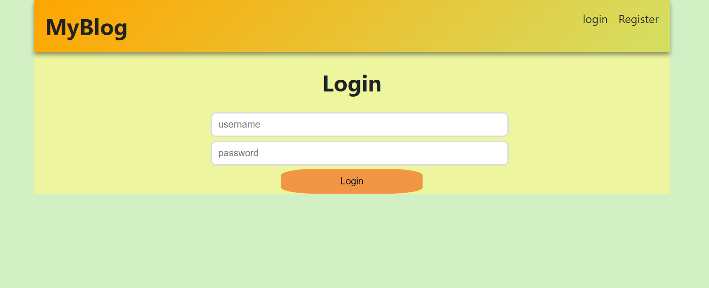

# Blogging Website Readme

## Project Overview

This is a full-stack blogging website that allows users to create and share their memories through public blog posts. The project is developed using Express.js and Node.js for the backend, MongoDB as the database system, and JWT (JSON Web Tokens) for user authentication and authorization.

## Features
- **User Authentication:** Secure user access is ensured through JWT. Only registered users can create and manage their own blog posts.

- **Blog Post Creation:** Registered users can create, edit, and delete their blog posts. Each post is associated with the respective user.

- **Data Storage:** MongoDB is integrated as the database system, providing a scalable structure for storing blog posts and user information.

## Technologies Used
- **Frontend:** React.js
- **Backend:** Express.js and Node.js
- **Database:** MongoDB
- **Authentication:** JWT (JSON Web Tokens)

## Setup Instructions
1. **Clone Repository:**
   ```bash
   git clone https://github.com/amrahul14/Blogging-website
   cd your-blog-repo

## Screenshots

### Login Page



### Register Page


### Display Blogs Page


### Create new blog Page


## 1. Install Dependencies:

  npm install
  
## 2. Configure MongoDB:

Set up a MongoDB database and update the connection string in the .env file.

## 3. Set JWT Secret:

In the .env file, set a secure secret for JWT.

## 4. Run the Application:

npm start

## 5. Access the Application:

Open your browser and navigate to http://localhost:3000 (or the specified port).

## API Routes

POST /api/auth/register: Register a new user.
POST /api/auth/login: Log in and obtain JWT token.
GET /api/posts: Get all blog posts.
GET /api/posts/:postId: Get a specific blog post.
POST /api/posts: Create a new blog post (requires authentication).
PUT /api/posts/:postId: Update a blog post (requires authentication).
DELETE /api/posts/:postId: Delete a blog post (requires authentication).

## Contribution Guidelines

Fork the repository.

Create a new branch: git checkout -b feature/new-feature.

Make your changes and commit them: git commit -m 'Add new feature'.

Push to the branch: git push origin feature/new-feature.

Submit a pull request.

Feel free to contribute and enhance the functionality of the blogging website!

Happy Blogging! 🚀
